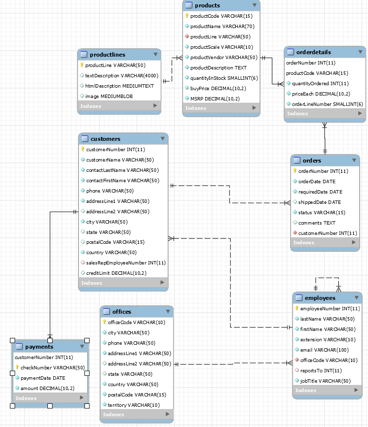
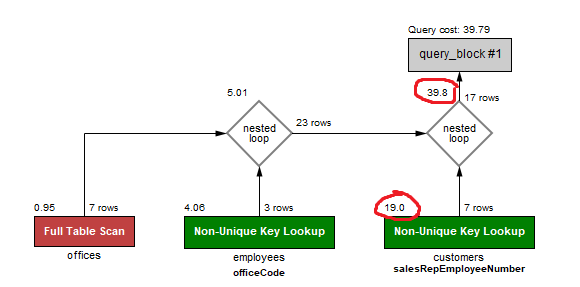
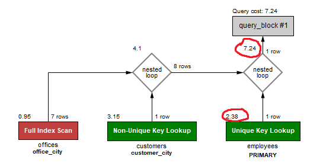

# DB Assignment 6 (Performance)
Made by Viktor Kim Christiansen, Chris Rosendorf & William Pfaffe
# Overview
School assignment with focus on performance with sample databases.
1. Run the DB with Docker `docker run --rm --name my_mysql -p 3306:3306 -e MYSQL_ROOT_PASSWORD=tropaadet -d mysql:latest`
2. TODO ADD INSTRUCTIONS AND SCRIPT FOR ADDING SAMPLE DATABASES!!!

Overview of classicmodels


## Exc 1 
### In the classicmodels database, write a query that picks out those customers who are in the same city as office of their sales representative.
```
SELECT customers.* FROM customers
INNER JOIN employees ON employees.employeeNumber = customers.salesRepEmployeeNumber
INNER JOIN offices ON offices.officeCode = employees.officeCode
WHERE customers.city = offices.city
```


### What is the main performance problem for this query
We see the biggest prefix cost at the `Non-Unique Key Lookup for customers salesRepEmployeeNumber`


## Exc 2
### Change the database schema so that the query from exercise get better performance.

```
Create index office_city ON offices (city);
Create index customer_city ON customers (city);
```



### Explain in the readme file what changes you did, if you changed the query or the schema
We add indexes for office_city on the office table & customer_city on the customer table. That way we can circumvent the salesRepEMployeeNumber lookup, and just use the unique indexes the cities give us instead, as well as the employees primary key.

## Exc 3

### We want to find out how much each office has sold and the max single payment for each office. Write two queries which give this information

1. using grouping
```
SELECT offices.officeCode, orderdetails.orderNumber, sum(orderdetails.quantityOrdered * orderdetails.priceEach) AS orderPrice FROM orderdetails
INNER JOIN orders ON orderdetails.orderNumber = orders.orderNumber
INNER JOIN customers ON orders.customerNumber = customers.customerNumber
INNER JOIN employees ON customers.salesRepEmployeeNumber = employees.employeeNumber
INNER JOIN offices ON employees.officeCode = offices.officeCode
GROUP BY orderNumber, officeCode
ORDER BY officeCode

```

2. using windowing
```

```

## Exc 4


## Exc 5
